# markdown-view 処理フローAST

このドキュメントは `markdown_view::architecture::application_flow()` が表す、
アプリケーション処理フローの概要です。

```mermaid
flowchart TD
  app["markdown-view"]
  startup["起動フロー"]
  http["HTTPレンダリングフロー"]
  watch["ファイル監視更新フロー"]
  browser["ブラウザWebSocketフロー"]

  app --> startup
  app --> http
  app --> watch
  app --> browser

  startup --> logging["ログ初期化"]
  startup --> cli["CLI引数解析"]
  startup --> path["パス検証"]
  startup --> mode["モード判定"]
  mode --> single["単一ファイルモード"]
  mode --> directory["ディレクトリモード"]
  startup --> state["AppState作成"]
  startup --> server["HTTPサーバー起動"]

  http --> guard["Host検証"]
  http --> route["ルーティング"]
  http --> load["Markdown読み込み"]
  http --> render["render_markdown"]
  render --> events["Markdownイベント処理"]
  http --> toc["TOC生成"]
  http --> page["ページHTML生成"]
  http --> response["HTTPレスポンス"]

  watch --> fswatch["ファイル監視"]
  watch --> debounce["debounce処理"]
  watch --> reload["Markdown再読み込み"]
  watch --> rerender["render_markdown"]
  watch --> retoc["TOC再生成"]
  watch --> broadcast["WebSocket broadcast"]

  browser --> initial["初期HTML読み込み"]
  browser --> bootstrap["クライアント初期化"]
  browser --> ws["WebSocket接続"]
  browser --> receive["更新メッセージ受信"]
  browser --> replace["本文差し替え"]
  browser --> memo["メモ同期"]
```



## 使い方

Rust側から処理フローを扱う場合は、`application_flow()` でASTを取得し、
`to_mermaid()` でMermaid flowchartに変換できます。

```rust
use markdown_view::architecture::application_flow;

let mermaid = application_flow().to_mermaid();
```

各ノードは名前、対応モジュール、対応関数を保持します。これはRust構文木ではなく、
設計・ドキュメント・レビュー用のアプリケーション意味ASTです。
